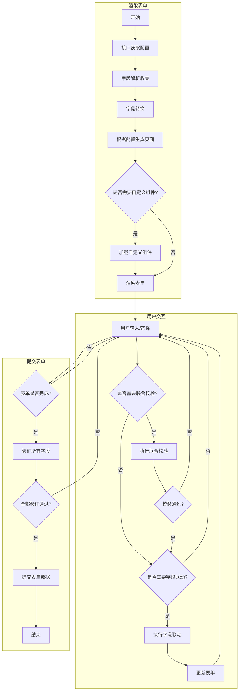

## 数据结构
```ts
type FormData = { [index: string]: any };
type Fn = (data: FormData) => string | void;
type ElType = "Radio" | "Checkbox" | "Input" | "Custom"; // ...

type Action = "clcik";

type Operate = {
  getForm: (key: string) => any;
  setForm: (key: string, val: any) => void;
  getField: (key: string) => any;
  setField: (key: string, option: string, val: any) => any;
  trigger: (field: Field, action: Action, data: any) => any;
};

interface Form {
  config: Field[];
  data: FormData;
  check: {
    confirm: Fn[];
    verify: Fn[];
  };
}

interface Field {
  key?: string;

  region: string;
  field: string;
  type: ElType;
  name: string;
  desc?: string;
  style?: string;
  disabled?: boolean;

  rules?: {
    required?: boolean;
    max?: number;
    min?: number;
    regex?: string;
  };

  actions?: Record<Action, (val: any, field: Field, op: Operate) => void>;
  subscription?: {
    [field: string]: (val: any, field: Field, op: Operate) => void;
  };
}

```
## 流程
