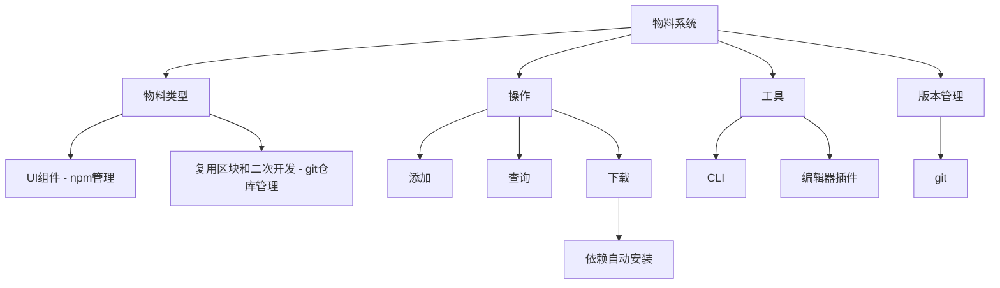
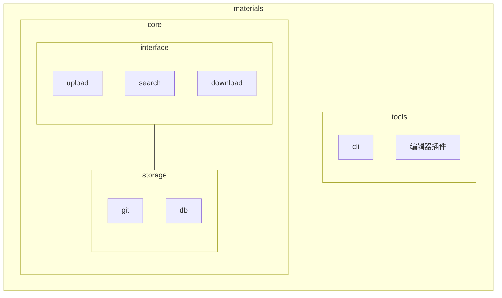
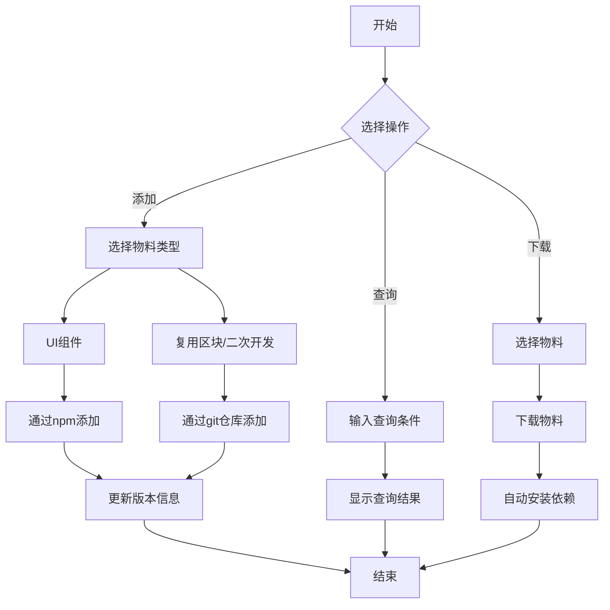

## 设计

```mermaid
graph TD
    A[物料系统] --> B[物料类型]
    A --> C[操作]
    A --> D[工具]
    A --> E[版本管理]
    
    B --> B1[UI组件 - npm管理]
    B --> B2[复用区块和二次开发 - git仓库管理]
    
    C --> C1[添加]
    C --> C2[查询]
    C --> C3[下载]
    C3 --> C3a[依赖自动安装]
    
    D --> D1[CLI]
    D --> D2[编辑器插件]
    
    E --> E1[git]
```
## 结构

```mermaid
flowchart TB
    subgraph materials
        subgraph core
            interface["interface"]
            storage["storage"]
            interface --- storage
            
            subgraph interface
                upload
                search
                download
            end
            
            subgraph storage
                git
                db
            end
        end
        
        subgraph tools
            cli
            editor["编辑器插件"]
        end
    end

    %% 调整布局
    core ~~~ tools
```

## 流程

```mermaid
graph TD
    A[开始] --> B{选择操作}
    B -->|添加| C[选择物料类型]
    C --> D[UI组件]
    C --> E[复用区块/二次开发]
    D --> F[通过npm添加]
    E --> G[通过git仓库添加]
    F --> H[更新版本信息]
    G --> H
    B -->|查询| I[输入查询条件]
    I --> J[显示查询结果]
    B -->|下载| K[选择物料]
    K --> L[下载物料]
    L --> M[自动安装依赖]
    H --> N[结束]
    J --> N
    M --> N
```

